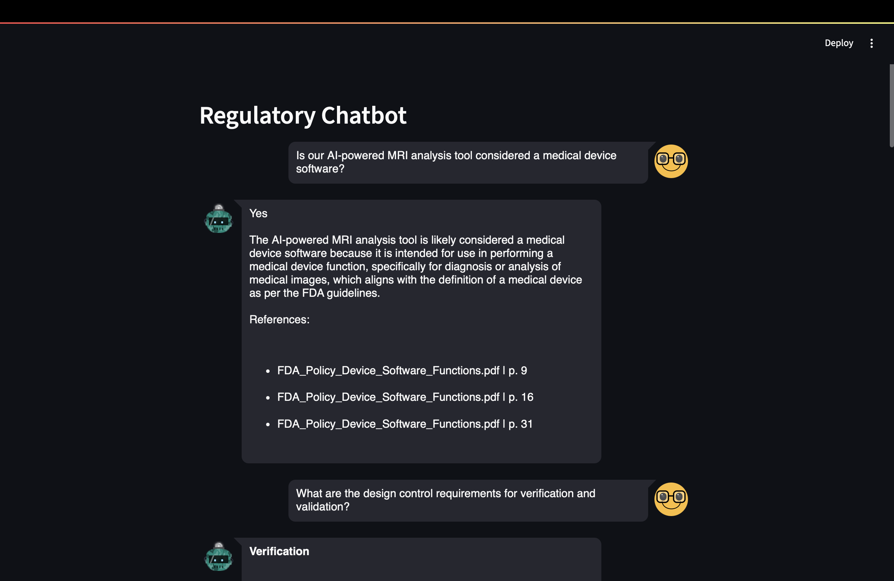

# 🏥 Regulatory Chatbot

An intelligent chatbot that answers regulatory questions about medical devices using AI and official documents from FDA, WHO, and more. It uses Retrieval-Augmented Generation (RAG) to find and cite relevant excerpts from PDFs and provides structured, reference-backed answers.

---

## 📌 Features

- ✅ Answers yes/no, list-based, and comparison questions with proper structure.
- 📄 Cites sources with page numbers from uploaded regulatory PDFs.
- 🔍 Uses MMR-based document retrieval for relevance and diversity.
- 🧠 Powered by OpenAI's GPT model with LangChain RAG pipeline.
- 💬 Streamlit-based interactive chat UI.

---


## 🚀 How to Run

### 1. Clone the repository

```bash
git clone https://github.com/yourname/regulatory-chatbot.git
cd regulatory-chatbot
```

### 2. Install dependencies
```bash
pip install -r requirements.txt
```


### 3. Add your PDF documents

Place your regulatory documents inside the docs/ folder.

### 4. Set your OpenAI API key
```bash
export OPENAI_API_KEY=sk-...
```

### 5. Run the app
```bash
streamlit run frontend.py
```
### 6. Chatbot Screenshot




